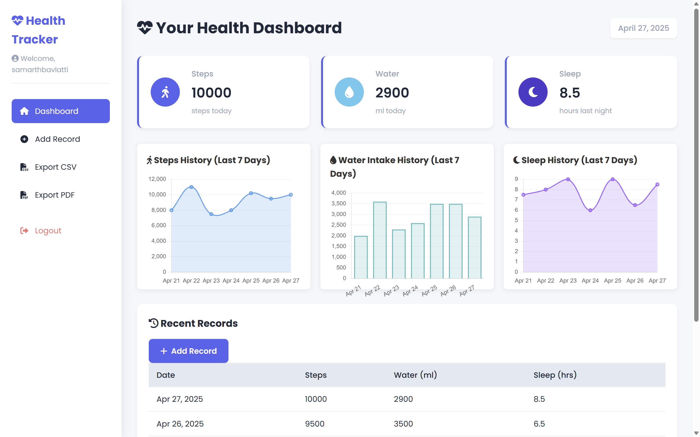
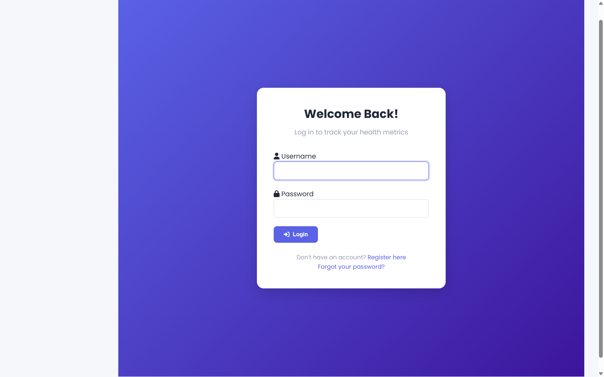
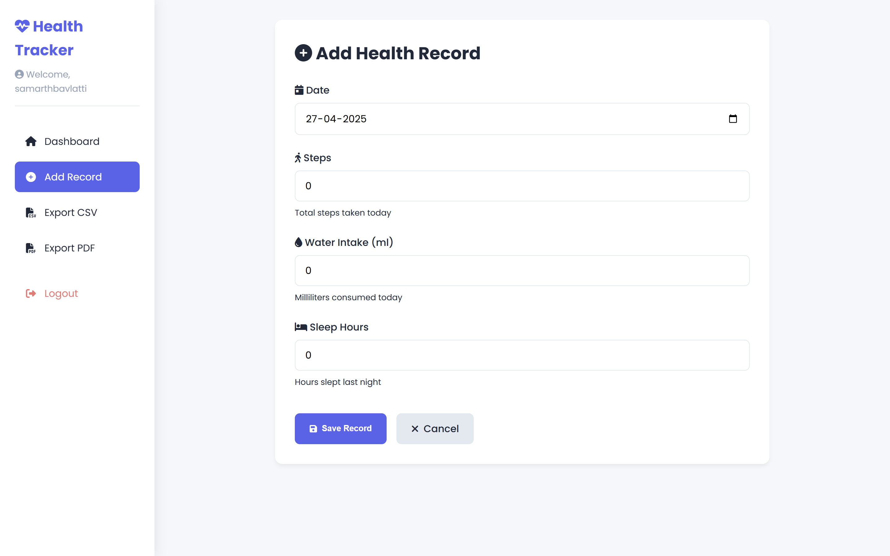

# Health Tracker Application



A Django-based web application for tracking daily health metrics including steps, water intake, and sleep hours.

## Features

- **User Authentication**: Secure login/registration system
- **Daily Tracking**: Record steps, water intake, and sleep hours
- **Dashboard**: Visualize health data with interactive charts
- **Data Export**: Download records as CSV or PDF
- **Responsive Design**: Works on desktop and mobile devices

## Tech Stack

- **Backend**: Django 4.2
- **Database**: PostgreSQL
- **Frontend**: HTML5, CSS3, JavaScript (Chart.js)
- **Deployment**: (Specify if deployed, e.g., Heroku/AWS)

## Project Structure
HEALTH_TRACKER2.0/
├── health_tracker/ # Django project config
│ ├── settings.py # Project settings
│ ├── urls.py # Main URLs
│ └── ...
├── static/ # CSS/JS assets
├── tracker/ # Main app
│ ├── models.py # Database models
│ ├── views.py # Application logic
│ └── templates/ # HTML templates
├── manage.py # Django CLI
├── requirements.txt # Python dependencies
├── .env.example # Environment template
└── README.md # This file


## Installation

### Prerequisites
- Python 3.9+
- PostgreSQL 12+
- Git

### Setup Steps

1. Clone the repository:
   ```bash
   git clone https://github.com/your-username/health-tracker.git
   cd health-tracker

   python -m venv venv
   source venv/bin/activate  # Linux/Mac
   venv\Scripts\activate     # Windows

   pip install -r requirements.txt

# Edit .env with your actual values
   cp .env.example .env

python manage.py migrate

python manage.py runserver

### Usage
    Register a new account or login

    Add daily health records via "Add Record"

    View your dashboard with visualized data

    Export data when needed

### Screenshots
Login
	

Add Record
